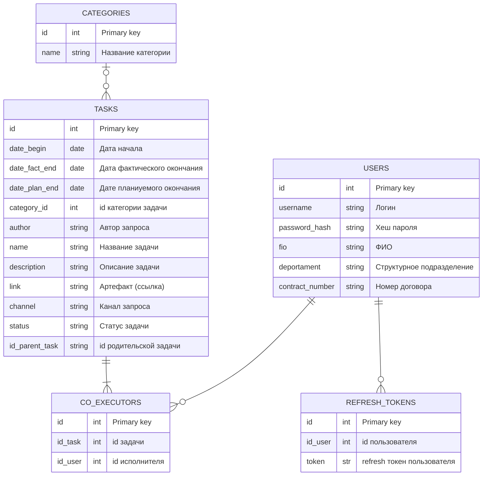

```mermaid
erDiagram
    USERS ||--o{ CO_EXECUTORS : ""
    USERS ||--o{ REFRESH_TOKENS : ""
    TASKS ||--|{ CO_EXECUTORS : ""
    CATEGORIES |o--o{ TASKS : ""
    

    USERS {
        id int "Primary key"
        username string "Логин"
        password_hash string "Хеш пароля"
        fio string "ФИО"
        deportament string "Структурное подразделение"
        contract_number string "Номер договора"
    }

    TASKS {
        id int "Primary key"
        date_begin date "Дата начала"
        date_fact_end date "Дата фактического окончания"
        date_plan_end date "Дате планиуемого окончания"
        category_id int "id категории задачи"
        author string "Автор запроса"
        name string "Название задачи"
        description string "Описание задачи"
        link string "Артефакт (ссылка)"
        channel string "Канал запроса"
        status string "Статус задачи"
        id_parent_task string "id родительской задачи"
    }

    CATEGORIES {
        id int "Primary key"
        name string "Название категории"
    }

    CO_EXECUTORS {
        id int "Primary key"
        id_task int "id задачи"
        id_user int "id исполнителя"
    }

    REFRESH_TOKENS {
        id int "Primary key"
        id_user int "id пользователя"
        token str "refresh токен пользователя"
    }
```